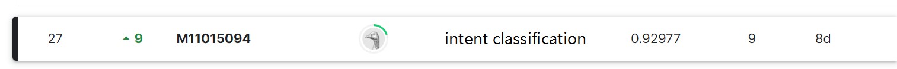

<h1><center>REPORT</center></h1>

## ADL HW1
- task1. intent classification
- task2. slot tagging

#### kaggle

[kaggle intent classification](https://www.leaderboard.com/c/ntu-adl-hw1-intent-cls-spring-2022/) \

[kaggle slot tagging](https://www.kaggle.com/c/slot-tagging-ntu-adl-hw1-spring-2022/) 


#### download model
```shell
./download.sh   # download model,and pretrained cache
```

#### test
```shell
intent_cls.sh # test the model, generate output
slot_tag.sh 
```

#### train
```shell
python train_intent.py
python slot.py
```

#### Training from scratch
```
sh preprocess.sh  # download glove, unzip it, and generate word embedding file
cd slot && python slot.py
cd intent && python train_intent.py
```
